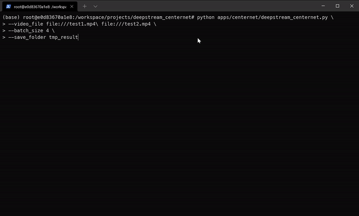
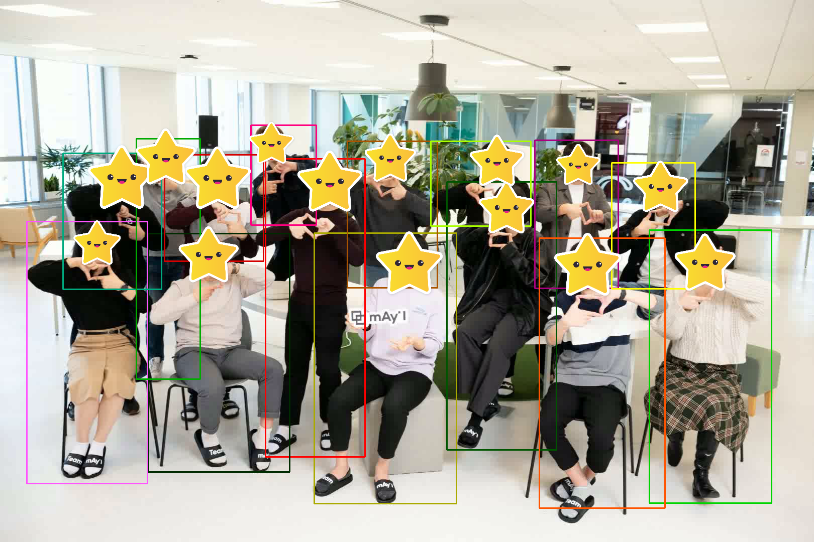

<div align="center">
  <a href="https://medium.com/may-i-lab">
  
  </a>
</div>

# Deploying CenterNet model using NVIDIA DeepStream #

This repository contains contains the the code and configuration files required to deploy CenterNet models video analytics using DeepStream SDK 6.0.

## Installation ##
Please refer to [Install.md](doc/Install.md) for installation.


## Getting Started ##

### Install rich and opencv-python ###

`pip install -r requirements.txt`

* [Rich](https://github.com/Textualize/rich) is great progress bar tool


### To run Deepsteam, change the ONNX to TensorRT ###
```shell
cd apps/centernet
python onnx2trt.py \
  --load_model models/multi_pose_dla34_coco_3x.onnx \
  --save_model models/multi_pose_dla34_coco_3x_b4_512_fp16.plan \
  --batch_size 4 \
  --fp16
```
* Download [multi_pose_dla34_coco_3x.onnx](https://1drv.ms/u/s!AtpHpqkl2-8CgpRK0Vy--JAKFJZf5g?e=cgb8nJ)


### Custom Parser ###
`cd apps/centernet/lib && make`
* Reference : [NVIDIA-AI-IOT](https://github.com/NVIDIA-AI-IOT/deepstream_triton_model_deploy/blob/master/centerface/README.md#custom-parser)


### Run ###
To Run deepstream centernet:

```shell
python apps/centernet/deepstream_centernet.py \
  --video_file file:///test1.mp4\ file:///test2.mp4 \
  --batch_size 4 \
  --save_folder result
```



result format(json):
```
detection_result = {
  "stream_0": {
    "frame_index": [
      {"bbox": [x1, y1, x2, y2], "score": 0.xx},
      ...
      ]
  }
}
```

<details>
<summary>Visualize</summary>
We are mAy-I !!


</details>

## Reference
* CenterNet: https://github.com/xingyizhou/CenterNet
* deepstream_triton_model_deploy: https://github.com/NVIDIA-AI-IOT/deepstream_triton_model_deploy
* deepstream_python_apps: https://github.com/NVIDIA-AI-IOT/deepstream_python_apps
* mmcv: https://github.com/open-mmlab/mmcv 
